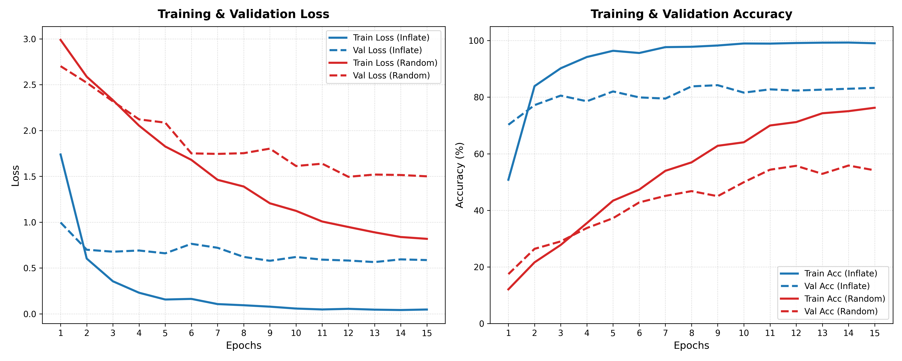

# Spatio-Temporal Action Recognition: TSN & 3D ResNet-18

An end-to-end PyTorch implementation of deep learning architectures for video action recognition on a 25-class subset of the UCF101 dataset (miniUCF). This project implements and evaluates two classic paradigms: **Temporal Segment Networks (TSN)** (ECCV 2016) and **3D ResNet-18** from scratch with weight inflation (CVPR 2017).

---

## Key Achievements
*   **Late Fusion Best Validation Accuracy**: Achieved **93.80%** validation accuracy on miniUCF by performing late probability fusion of RGB and Optical Flow TSNs.
*   **3D ResNet-18 from Scratch**: Implemented a custom 3D equivalent of the ResNet-18 architecture with 3D convolutions (`Conv3d`) and 3D pooling (`MaxPool3d`) layers.
*   **Weight Inflation (I3D)**: Bootstrapped 3D filters from 2D ImageNet-pretrained weights, boosting peak accuracy from **55.84%** (random init) to **84.23%** (inflated).
*   **Spatio-Temporal Consistency**: Standardized random spatial crops across frames to maintain temporal coherence.
*   **Multi-View Inference**: Implemented temporal consensus testing across 4 spatial-temporal views.

---

## Directory Structure

```text
├── 3DResNet/
│   ├── dataset.py            # Spatio-temporal dataset loader & consistent augmentations
│   ├── model.py              # Custom 3D ResNet-18 & 2D-to-3D Weight Inflation algorithm
│   ├── main.py               # 3D training and multi-view validation loop
│   └── preprocess_videos.py  # Parallel AVI-to-JPEG frame extractor
├── TSN/
│   ├── dataset.py            # Segmented sampling & 10-channel flow stacking
│   ├── model.py              # TSN with cross-modality pretraining first-layer reshape
│   └── main.py               # TSN training & late fusion evaluation
├── data/                     # (Excl. datasets) Holds split lists and class mapping
│   ├── classes.txt
│   ├── train.txt
│   └── validation.txt
├── 3dresnet_comparison_curves.png  # High-res performance curves
└── README.md
```

---

## Environment Setup
Make sure you have Miniconda installed. Create and activate the environment:
```bash
conda create -n action_rec python=3.10 -y
conda activate action_rec
pip install torch torchvision torchaudio --index-url https://download.pytorch.org/whl/cu121
pip install opencv-python-headless Pillow numpy matplotlib scikit-learn tqdm
```

---

## How to Run

### 1. Data Preprocessing
Extract JPEG frames from original `.avi` videos to boost training I/O speed:
```bash
python 3DResNet/preprocess_videos.py
```

### 2. Temporal Segment Networks (TSN)
Submit training jobs for Spatial (RGB) and Temporal (Flow) streams:
```bash
# RGB TSN with ImageNet pretrained initialization
python TSN/main.py --modality RGB --init_strategy imagenet

# Optical Flow TSN with ImageNet cross-modality initialization
python TSN/main.py --modality Flow --init_strategy imagenet

# Optical Flow TSN with Random initialization (Baseline)
python TSN/main.py --modality Flow --init_strategy random
```
Run Late Fusion evaluation and Per-Class comparison once weights are saved:
```bash
python TSN/main.py --evaluate_fusion
```

### 3. RGB 3D ResNet
Train the 3D ResNet-18 model under different initialization configurations:
```bash
# Training with Weight Inflation
python 3DResNet/main.py --init_strategy inflate

# Training with Random Initialization
python 3DResNet/main.py --init_strategy random
```

---

## Experimental Results

### 3D ResNet-18: Random vs. Inflation (I3D)
Weight inflation from 2D pre-trained ImageNet layers yields a massive boost in convergence speed and overall accuracy:

| Initialization Strategy | Peak Val Accuracy | Epoch | Final Train Loss | Final Val Loss |
| :--- | :---: | :---: | :---: | :---: |
| **Random Initialization** | 55.84% | 14 | 0.8185 | 1.5004 |
| **Weight Inflation (I3D)** | **84.23%** | **9** | **0.0476** | **0.5869** |



### TSN Modality Fusion
By averaging the probability distributions of RGB (Appearance) and Optical Flow (Motion) at test time, we achieve a highly complementary overall classifier:

*   **RGB TSN Only**: 89.17% Peak Val Accuracy
*   **Optical Flow TSN Only**: 82.86% Peak Val Accuracy
*   **Late Fusion (RGB + Flow)**: **93.80%** Peak Val Accuracy

---

## References
1. **Temporal Segment Networks (TSN)**:
   * Limin Wang, Yuanjun Xiong, Zhe Wang, Yu Qiao, Dahua Lin, Xiaoou Tang, and Luc Van Gool. *"Temporal Segment Networks: Towards Good Practices for Deep Action Recognition."* European Conference on Computer Vision (ECCV), 2016.
   * [ArXiv Paper Link](https://arxiv.org/abs/1608.00859)

2. **Inflated 3D ConvNets (I3D / Quo Vadis)**:
   * Joao Carreira and Andrew Zisserman. *"Quo Vadis, Action Recognition? A New Model and the Kinetics Dataset."* IEEE Conference on Computer Vision and Pattern Recognition (CVPR), 2017.
   * [ArXiv Paper Link](https://arxiv.org/abs/1705.07750)

3. **Two-Stream Convolutional Networks**:
   * Karen Simonyan and Andrew Zisserman. *"Two-Stream Convolutional Networks for Action Recognition in Videos."* Advances in Neural Information Processing Systems (NIPS), 2014.
   * [ArXiv Paper Link](https://arxiv.org/abs/1406.2199)

4. **UCF101 Dataset**:
   * Khurram Soomro, Amir Roshan Zamir, and Mubarak Shah. *"UCF101: A Dataset of 101 Human Actions Classes from Videos in the Wild."* CRCS-TR-12-01, 2012.
   * [ArXiv Paper Link](https://arxiv.org/abs/1212.0402)

---

## Author
*   **Jinglin Zhu** - [GitHub Profile](https://github.com/partner-username) - *Implementation, Evaluation, and Documentation*
*   This project was developed as part of the **Video Analytics (SS26)** course at the **University of Tübingen**.

## Disclaimer
This repository is an independent PyTorch re-implementation of the Temporal Segment Networks (TSN) and 3D ResNet-18 architectures, developed solely for academic and educational purposes. All rights, patents, and intellectual property regarding the original algorithms, network designs, and methodologies belong to the respective authors of the landmark papers cited in the references section above.
